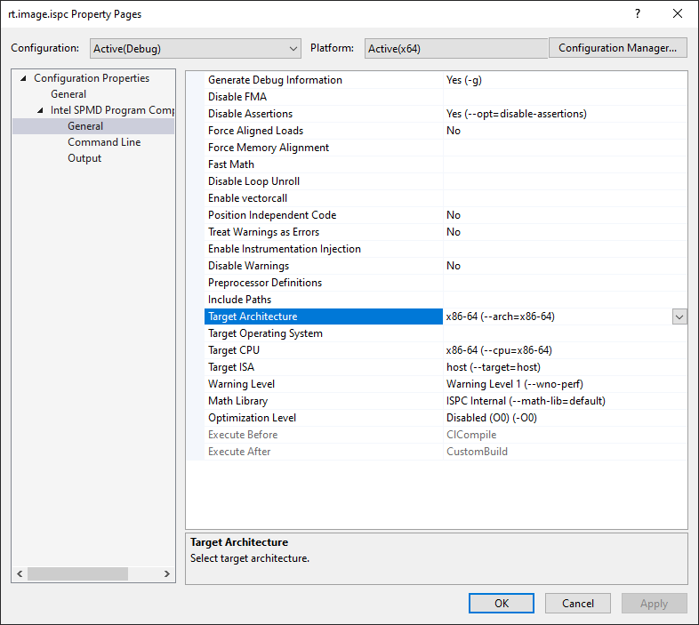
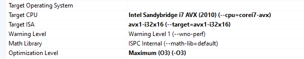
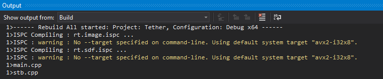
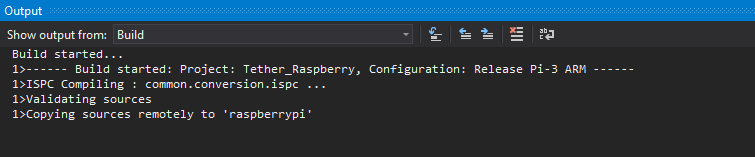
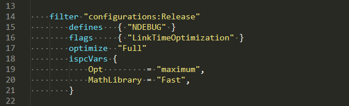
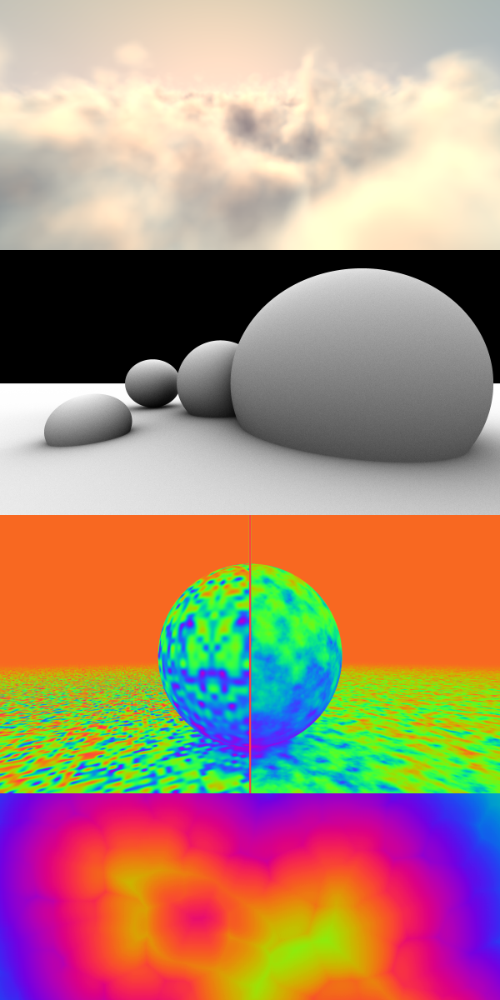

# Tether

**Tether** allows tight integration of the [Intel SPMD Compiler](https://ispc.github.io/index.html) - ISPC - into Visual Studio C++ projects via a dedicated MSBuild module, making `.ispc` files a first-class project citizen for both Windows and ARM targets.



A nearly complete set of ISPC parameters are exposed, complete with descriptive names.



Change-tracking ensures ISPC only builds files when required (although we are presently *over-cautious* when it comes to changes to `.isph` headers)



Experimental support for cross-compilation to ARM is provided using ISPC compilation on PC and then deploying compiled units to a remote machine via Visual Studio's remote Linux integeration



The **Tether** project also demonstrates an integration into [Premake 5](https://premake.github.io/index.html) solution generation, easily producing varied build rules with custom ISPC configurations.



---

## Also Included

A curated foundation of essential ISPC functionality provides a baseline for examples and [Picobench](https://github.com/iboB/picobench) benchmarking.

A library of useful common functions are defined with heavy preprocessor wrangling to produce `uniform`/`varying` combinations across the usual tuple types (`float3`, `float2`, etc).

Most shader-adjacent functions - `frac`, `length`, `saturate`, `smoothstep`, `distance`, `dot`, etc - are available on any type. 

Random number generators, various noises, some SDF and audio functionality are also provided to support some of the examples.

Using more macro magic and [CxxSwizzle](https://github.com/gwiazdorrr/CxxSwizzle) from Piotr Gwiazdowski, we can compile ISPC examples in C++ mode 'mostly automatically' which gives a great basis for performance experiments and benchmarking.

## Benchmarking / Examples

Some samples are provided that can be run in ISPC or Serial (C++) mode, all producing some kind of result file (eg. a PNG or a WAV file) for inspection and comparison. Some are ported from [shadertoy](https://shadertoy.com) or the original Intel examples in ISPC.



Included samples are run in Picobench to show the delta between ISPC and Serial mode. Note that running the full suite on a Raspberry Pi can take a full hour!

```
---------------------------------------------------------------------------------------------------------
Win64 w. AVX2 (Serial/C++) Code Generation; ISPC 1.15.0 w. avx2-i32x16

sample-sdf:
===============================================================================
   Name (baseline is *)   |   Dim   |  Total ms |  ns/op  |Baseline| Ops/second
===============================================================================
                   ispc * |       1 |   168.871 |168870e3 |      - |        5.9
                   serial |       1 |  1200.441 |120044e4 |  7.109 |        0.8
                   ispc * |       2 |   186.022 |93010950 |      - |       10.8
                   serial |       2 |  1497.695 |748847e3 |  8.051 |        1.3
===============================================================================
sample-render-clouds:
===============================================================================
   Name (baseline is *)   |   Dim   |  Total ms |  ns/op  |Baseline| Ops/second
===============================================================================
                   ispc * |     320 |   185.546 |  579832 |      - |     1724.6
                   serial |     320 |  7032.005 |21975014 | 37.899 |       45.5
                   ispc * |     640 |   726.663 | 1135411 |      - |      880.7
                   serial |     640 | 28134.653 |43960395 | 38.718 |       22.7
===============================================================================
```

### Current Features

 - ISPC 1.15.0 support, trivial to retarget to new/old version
 - extensive properties dialog for the build step with all ISPC tunable values exposed
 - proper MSBuild change tracking support for `.ispc` files
 - catch-all change support for `.isph` headers
 - excellent debuggability (assuming you're in Debug)
 - premake5 support with custom (experimental) Raspberry Pi platform add-on

### Future Plans

 - figure out how to do per-header change tracking in MSBuild
 - support multi-target compilation (add multiple object outputs to linker inputs .. somehow)

---
## About ISPC 

*ISPC* is an LLVM-based compiler for a variant of the C programming language, with extensions for "single program, multiple data" (SPMD) programming. Under the SPMD model, the programmer writes a program that generally appears to be a regular serial program, though the execution model is actually that a number of program instances execute in parallel on the hardware. (See the ispc documentation for more details and examples that illustrate this concept.)

Original site : <https://ispc.github.io/index.html>

Online Documentation : <https://ispc.github.io/documentation.html>

To a C/C++ or GPU shader programmer, ISPC code looks familiar but adds some extensions and restrictions to ensure the compiler can optimally rearrange the work expressed into vectorized operations.

```cpp
export void fieldToRGB( 
    uniform float input[],
    uniform u32   input_width,
    uniform u32   input_height,
    uniform u32   output[]
    )
{
    uniform float recp_width = 1.0f / input_width;

    foreach_tiled( y = 0 ... input_height,
                   x = 0 ... input_width )
    {
        u32 offset = ( y * input_width ) + x;

        float dx = (float)x * recp_width;
        float dy = (float)y * recp_width;

        float iv = input[offset] * 0.05f;

        float3 rgbF = hsvToRgb( SmootherStep( iv, -1.0f, 1.0f ), 1.0f, saturate( 1.0f - iv ) );

        output[offset] = rgbToU32( rgbF );
    }
}
```

---
## Tether Installation

##### MSBuild

The main support files are in `/ispc-msbuild`

| File  | Notes        |
| -----:|--------------|
| ispc.xml                 | Declares all available properties that will be exposed in the IDE (ie. in `File -> Properties -> ISPC` in the solution explorer). If you upgraded ISPC and they exposed new switches and settings, you would set them up in here. |
| ispc.props               | Defines the default property values (from `ispc.xml`) that are applied to an ISPC file, and what are defined as 'project defaults' in the IDE  |
| ispc.targets             | The meta-scripting MSBuild xml hell that makes all this work. Just try to ignore this file. |

By default, the `ispc.props` file expects a deployment of ISPC one directory back, eg.

```
/ispc-1.15.0/bin/ispc.exe
/ispc-msbuild/
```

.. with the version set in the props file
```
  <PropertyGroup>
      <CompilerName>ispc-1.15.0</CompilerName>
  </PropertyGroup>
```

##### Premake

A small bootstrap is provided in the root `premake5.lua`; this adds the function `addISPCRules()` which other projects can call to allow ISPC compilation. What this does internally is add references to the MSBuild control files found in `/tools/ispc`


Look inside a `vcxproj` for a project using ISPC to see the hooks where those files are included;

```xml
  <ImportGroup Label="ExtensionSettings">
    <Import Project="..\..\tools\ispc\ispc.props" />
  </ImportGroup>

  ...

  <ImportGroup Label="ExtensionTargets">
    <Import Project="..\..\tools\ispc\ispc.targets" />
  </ImportGroup>
```

---
#### Dependencies

Currently there is no way (or not that I can reason inside the mind-scrambling misery that is MSBuild) for us to easily track what header files a `.ispc` includes, and thus make sure we automatically rebuild them if the header changes. 

As a compromise, we can for and watch *all* `.isph` headers. If any change, all `.ispc` files should rebuild. Better than the alternative!


---
#### Exported Functions

ISPC produces a native .obj file that is directly linked into a resulting binary. To call your generated functions, you must include a generated header that ISPC will build for you.

```cpp
//
// ..\..\src\core\ispc\.gen/rt.sdf_ispc.gen.h
// (Header automatically generated by the ispc compiler.)
// DO NOT EDIT THIS FILE.
//

#pragma once
#include <stdint.h>

#ifdef __cplusplus
namespace ispc { /* namespace */
#endif // __cplusplus

#ifndef __ISPC_ALIGN__
#if defined(__clang__) || !defined(_MSC_VER)
// Clang, GCC, ICC
#define __ISPC_ALIGN__(s) __attribute__((aligned(s)))
#define __ISPC_ALIGNED_STRUCT__(s) struct __ISPC_ALIGN__(s)
#else
// Visual Studio
#define __ISPC_ALIGN__(s) __declspec(align(s))
#define __ISPC_ALIGNED_STRUCT__(s) __ISPC_ALIGN__(s) struct
#endif
#endif

///////////////////////////////////////////////////////////////////////////
// Functions exported from ispc code
///////////////////////////////////////////////////////////////////////////
#if defined(__cplusplus) && (! defined(__ISPC_NO_EXTERN_C) || !__ISPC_NO_EXTERN_C )
extern "C" {
#endif // __cplusplus

    extern float sdFieldSubtract(float * field, float * subtraction, int32_t width, int32_t height);
    extern float sdPolygonField(float * vertX, float * vertY, int32_t nverts, float * output, int32_t output_width, int32_t output_height);

#if defined(__cplusplus) && (! defined(__ISPC_NO_EXTERN_C) || !__ISPC_NO_EXTERN_C )
} /* end extern C */
#endif // __cplusplus


#ifdef __cplusplus
} /* namespace */
#endif // __cplusplus
```

By default (set in the `ispc.props` file), these headers are emitted into a directory named `.gen` next to the `.ispc` file being compiled. The reasoning here is that we never check in the `.gen` folder and the headers are treated as build artifacts themselves too. By default ISPC tries to write them out each time and having them checked in can cause warnings / annoyance.

Create one or more `exports.h` files that can manually include the generated headers as a single point of entry to all exposed functions. 


---
#### Editing Experience

We recommend using _Visual Studio Code_ for editing ISPC files, as there is an official extension that supports a degree of intellisense / highlighting. Search for `intel-corporation.ispc` in VSC to install it.

